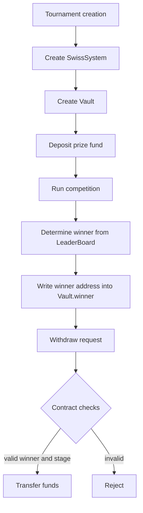

# Competition Constructor Program

The `competition-constructor-program` is a Solana/Anchor smart contract for running competition tournaments using a Swiss-system model. It supports tournament creation, participant registration, point scoring, winner determination, and secured prize distribution.

## What this project does

- Creates a Swiss-system competition
- Manages participant registration and competition stages
- Stores prize funds in an on-chain vault
- Determines the winner based on leaderboard results
- Enables the winner to withdraw the prize

## Core architecture

### Main accounts

- `SwissSystem` — the main competition account
- `Participant` — a participant account in the tournament
- `LeaderBoard` — the leaderboard and score storage
- `Vault` — prize fund storage tied to the tournament

### Key flows

1. Create a Swiss-system tournament
2. Register participants
3. Update stages: registration, competition, withdrawal
4. Award points to participants
5. Determine the winner and record it in the `Vault`
6. Winner withdraws the prize

## How to run

```bash
# Install dependencies
cd /home/yutiuser/projects/solana/competition-constructor/competition-constructor-program
yarn install

# Build the Anchor program
anchor build

# Run tests
anchor test -- --features testing
```

If you want to run the faster tests from `Anchor.toml`:

```bash
yarn run ts-mocha -p ./tsconfig.json -t 1000000 ./tests/program_config.ts ./tests/constructor.ts ./tests/swiss_system.ts ./tests/swiss_system_vault_create.ts ./tests/swiss_system_vault_spl_create.ts ./tests/swiss_system_leaderboard_create.ts ./tests/swiss_system_participant_create.ts ./tests/swiss_system_points_award.ts ./tests/swiss_system_winner_determine.ts ./tests/swiss_system_prize_withdraw.ts
```

## Deployment

The program is deployed on devnet at: `63yvyYYUHSZyHEKnz4YerXBvZ5VomBwZtLF1XLmSWfbR`

## Tests

The `tests/` directory contains the following scenarios:

- `constructor.ts` — basic initialization checks
- `program_config.ts` — Anchor configuration and program addresses
- `swiss_system.ts` — general Swiss-system behavior tests
- `swiss_system_vault_create.ts` — vault creation tests
- `swiss_system_vault_spl_create.ts` — SPL vault creation tests
- `swiss_system_leaderboard_create.ts` — leaderboard creation tests
- `swiss_system_participant_create.ts` — participant registration tests
- `swiss_system_points_award.ts` — score awarding tests
- `swiss_system_winner_determine.ts` — winner determination tests
- `swiss_system_prize_withdraw.ts` — prize withdrawal tests
- `swiss_system_stage_update.ts` — competition stage update tests

## How the contract guarantees prize payout to the winner

The program uses a `Vault` account as a PDA (Program Derived Address), created from tournament-specific seeds. The prize funds remain locked by the program until:

- the competition stage has finished,
- the winner is determined,
- the current stage is the withdrawal period.

When the winner requests withdrawal, the smart contract verifies:

- the `Vault` account belongs to the correct Swiss-system tournament,
- the winner is recorded in the `Vault` state,
- the current stage is `WithdrawPeriod`,
- the request is made by the winner or an authorized recipient.

If all checks pass, the program transfers funds from the `Vault` to the winner's account.

## Prize payout flow diagram



## Guarantees

- No duplicate initialization of accounts
- Strict authority validation
- Deterministic leaderboard updates
- No zero-point or invalid point assignments
- Prize distribution only after winner determination

## Security considerations

While building the system, several edge cases were identified:

- role collision (authority = participant)
- duplicate initialization attacks
- inconsistent leaderboard updates

These are covered by tests.
